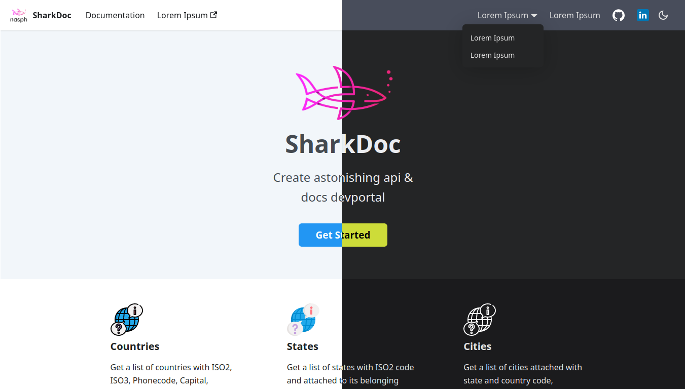
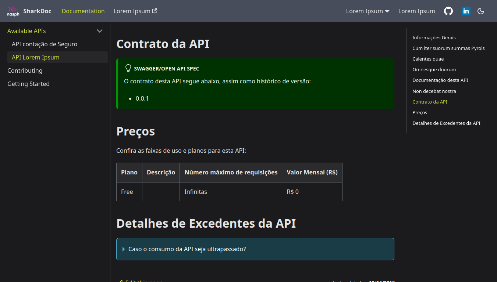
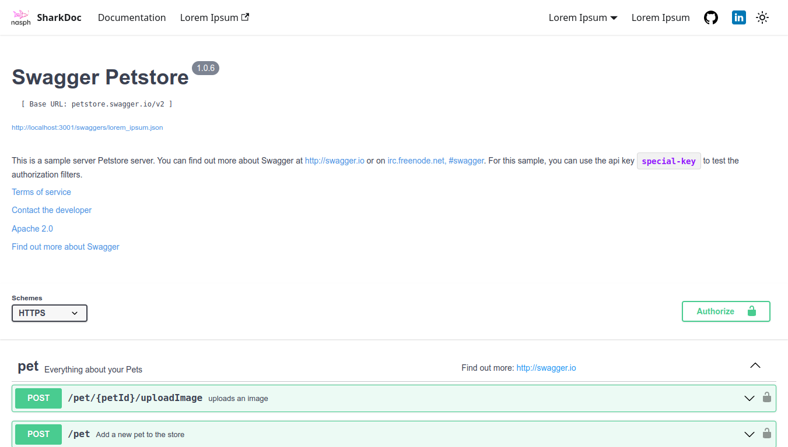

# Country State City API Website

This website is built using [Docusaurus 2](https://v2.docusaurus.io/), a modern static website generator.

## Preview

### Home (Light and Dark)


### Docs (Dark)


### Contract (Light)


## Installation

```console
yarn install
```

## Local Development

```console
yarn start
```

This command starts a local development server and open up a browser window. Most changes are reflected live without having to restart the server.

## Build

```console
yarn build
```

This command generates static content into the `build` directory and can be served using any static contents hosting service.

## Deployment

```console
GIT_USER=<Your GitHub username> USE_SSH=true yarn deploy
```

If you are using GitHub pages for hosting, this command is a convenient way to build the website and push to the `gh-pages` branch.
